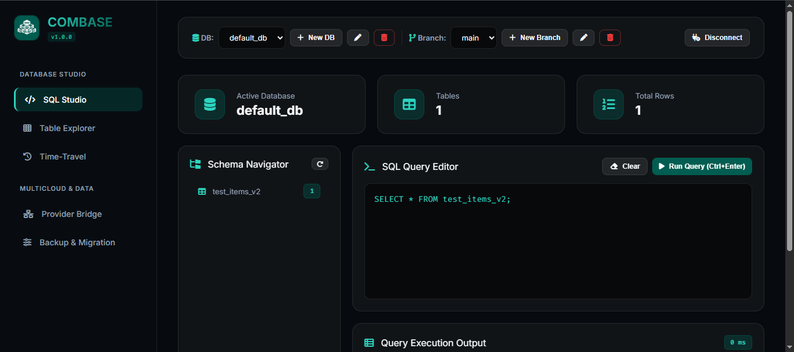

<p align="center">
  
</p>

<h1 align="center">COMBASE — Terra Ecosystem Database Engine</h1>

<p align="center">
  <strong>Motor de Base de Datos Relacional y Documental Transaccional, Serverless y con Time-Travel a Coste $0</strong>
</p>

<p align="center">
  <a href="#-visión-y-filosofía">Visión</a> •
  <a href="#-demostración-visual--sql-studio">SQL Studio</a> •
  <a href="#-instalación-y-uso">Instalación</a> •
  <a href="#-referencia-completa-de-la-cli">CLI Reference</a> •
  <a href="#-uso-del-sdk">SDK</a> •
  <a href="#-puente-multicloud-provider-bridge">Multicloud Bridge</a> •
  <a href="#-licencia">Licencia MIT</a>
</p>

---

## 🌐 Visión y Filosofía

**COMBASE** es el motor de base de datos relacional (ANSI SQL) y documental transaccional del **Ecosistema Terra**, diseñado para operar a **$0 facturas recurrentes** sin necesidad de mantener servidores ni instancias persistentes en RDS, Aurora, DynamoDB o Supabase.

Toda la base de datos se guarda de forma encriptada en tu repositorio privado **`.combase-storage`** de GitHub. Cada modificación o transacción atómica genera un **checkpoint inmutable (commit)** en Git con soporte para Time-Travel y Zero-Copy Branching.

---

## 🖼️ Demostración Visual — COMBASE SQL Studio

Accede a la consola web oficial en directo:  
👉 **[https://amglogicalis.github.io/combase-repo-public/](https://amglogicalis.github.io/combase-repo-public/)**



### ✨ Características de SQL Studio:
- **🔒 Autenticación Estricta E2E**: Acceso seguro mediante tu GitHub Personal Access Token (PAT).
- **💻 Editor SQL Interactivo**: Ejecución en tiempo real de consultas `SELECT`, `INSERT`, `UPDATE`, `DELETE`, `CREATE TABLE`, `ALTER TABLE` y `DROP TABLE`.
- **🔍 Table Explorer & Edición Visual**: Edición de celdas por doble clic, adición de filas en vivo y gestor visual de esquema de columnas.
- **🗄️ Gestión Multibase de Datos & Ramas**: Creación, renombrado y borrado limpio de bases de datos y ramas en caliente.
- **⏳ Time-Travel & Rollback**: Historial visual de commits con restauración de estado en 1 clic.
- **🌉 Puente Multicloud**: Importación e ingesta bidireccional desde PostgreSQL/Supabase y AWS DynamoDB.

---

## 📦 Instalación y Uso

Instala el paquete globalmente para acceder a la CLI y la Consola Web local desde cualquier directorio:

```bash
npm install -g terra-combase
```

O ejecútalo directamente usando `npx`:

```bash
npx terra-combase studio
# o también:
npx combase studio
```

---

## 🛠️ Referencia Completa de la CLI

| Comando | Descripción |
| :--- | :--- |
| `npx combase init` | Inicializa el archivo de configuración `combase.config.json`. |
| `npx combase studio` | Abre la consola web local en `http://localhost:3722`. |
| `npx combase db ls` | Lista las bases de datos registradas. |
| `npx combase db use <nombre>` | Cambia la base de datos activa y guarda la preferencia. |
| `npx combase db create <nombre>` | Crea una nueva base de datos. |
| `npx combase db rename <old> <new>` | Renombra una base de datos. |
| `npx combase db delete <nombre>` | Elimina una base de datos. |
| `npx combase sql "<SQL>"` | Ejecuta cualquier consulta o mutación SQL directamente en consola. |
| `npx combase table ls` | Lista todas las tablas en la base de datos activa. |
| `npx combase table inspect <tabla>` | Muestra las filas y estructura de una tabla. |
| `npx combase table create <t> "<cols>"` | Crea una nueva tabla. |
| `npx combase table add-col <t> <c> <tipo>` | Añade una nueva columna a una tabla. |
| `npx combase table drop-col <t> <col>` | Elimina una columna de una tabla. |
| `npx combase table rename <old> <new>` | Renombra una tabla. |
| `npx combase table drop <tabla>` | Elimina una tabla. |
| `npx combase data insert <t> col1=v1 col2=v2` | Inserta un nuevo registro. |
| `npx combase data update <t> "c=v" WHERE ...` | Actualiza registros existentes. |
| `npx combase data delete <t> WHERE ...` | Borra registros mediante filtro. |
| `npx combase branch ls` | Lista las ramas de base de datos activas. |
| `npx combase branch create <nombre>` | Crea una nueva rama (Zero-Copy Branching). |
| `npx combase branch switch <nombre>` | Cambia a la rama especificada. |
| `npx combase branch delete <nombre>` | Elimina una rama de base de datos. |
| `npx combase provider export <postgres\|dynamodb\|rolla>` | Genera DDLs de PostgreSQL, DynamoDB JSON o instantáneas Rolla/S3. |
| `npx combase provider import <archivo>` | Importa esquemas o datos externos. |
| `npx combase time-travel history` | Muestra el historial de checkpoints (commits) de Time-Travel. |
| `npx combase time-travel rollback <sha>` | Restaura la base de datos al estado del commit especificado. |
| `npx combase export [archivo.sql]` | Exporta la base de datos completa como volcado SQL. |
| `npx combase import <archivo.sql>` | Importa un volcado SQL a la base de datos. |

---

## ⚡ Uso del SDK en Node.js / TypeScript

```typescript
import { Combase } from 'terra-combase';

const combase = new Combase({
  githubToken: process.env.GITHUB_TOKEN,
  storageRepo: '.combase-storage',
  branch: 'main'
});

await combase.init();

// Crear tabla
await combase.query("CREATE TABLE users (id INTEGER PRIMARY KEY, name TEXT, email TEXT)");

// Insertar datos
await combase.query("INSERT INTO users (id, name, email) VALUES (1, 'Adrián', 'adrian@terra.org')");

// Consultar datos
const result = await combase.query("SELECT * FROM users WHERE id = 1");
console.log(result.rows);

// Generar script de migración para PostgreSQL / Supabase
const pgScript = await combase.generateProviderScript('postgres');
console.log(pgScript);
```

---

## 🌉 Puente Multicloud (Provider Bridge)

COMBASE permite sincronizar o exportar tus datos a cualquier otro motor tradicional con 1 solo comando:
- **PostgreSQL / Supabase**: Generación de DDLs de tablas e instrucciones `INSERT`.
- **AWS DynamoDB**: Generación de colecciones JSON y `PutRequest` para ingesta por lotes.
- **Rolla-Balls & S3**: Instantáneas comprimidas e inmutables almacenadas en **Rolla** (`.rolla-storage`) o AWS S3.

---

## 📄 Licencia

Este proyecto está bajo la Licencia **MIT** — Libre para uso personal y comercial.
